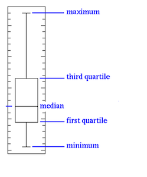
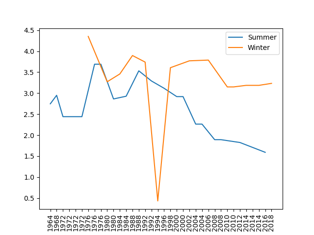

[](https://classroom.github.com/online_ide?assignment_repo_id=6220176&assignment_repo_type=AssignmentRepo)
# COMP0035 PBL 5: Data exploration

## Preparation

### Pre-requisite knowledge

It is assumed you have already completed the "How to explore a data set using pandas" activity in week 4 on Moodle.

The [pandas cheat sheet](pandas_cheat_sheet.md) in this repository lists the methods used in the 'how to' guide.

### Set-up

Create a new Python project by cloning the PBL5 repository (instructions below).

You can use any Python coding environment, including Jupyter, for this activity.

Make sure you have the following libraries in your Python environment (or venv):

```shell
pip install pandas matplotlib openpyxl
```

To create a new python project by creating a copy of the GitHub classroom assignment complete the following steps:

1. Accept the [GitHub classroom assignment](https://classroom.github.com/a/MiyTMAJq) to create a new repo
2. Copy the URL of the newly created repo
3. Create a project in your Python coding environment (e.g., PyCharm, VS Code, Atom, PythonAnywhere etc) by cloning from
   the URL
4. Create a venv (PBL1 explained how to create a venv)
5. Install pandas, matplotlib and openpyxl (PBL 1 explained how to add packages to a venv)

### Data

The data in the activities is from the following sources.

- [London 2012 Ticket Sales](https://data.london.gov.uk/download/london-2012-ticket-sales/4711eb39-cb56-4f47-804d-e486dae89a1d/assembly-london-2012-ticket-sales.xls)
- [Paralympic medals and event info](https://www.paralympic.org/london-2012/results/medalstandings)
- [Logos](https://colorlib.com/wp/all-olympic-logos-1924-2022/)

The data has been modified such that it can be used for a data cleaning activity.

You can either use your own dataset for this or [paralympics_prepared.csv](data/paralympics_prepared.csv) from the directory. If
using your own then place a copy in the `/data` directory of the project.

### Questions to be answered (paralympics data set)

To guide the activities, assume that the questions to answer from the data set are:

- How has the number of male and female competitors in the paralympics changed over time?
- Does the ratio of male:female competitors vary between winter and summer olympics?

In addition to the charts that will attempt to answer the questions, the web app will also feature a searchable history
of paralympic events with information about each event. The event information will include the country flag, the
paralympic logo, start and end dates and the duration of the event.

## Challenge solution from PBL4

The start and end date columns are text format, and the date doesn't include the year. Year is a separate field. You
need to combine 'dd-mmm' and 'yyyy' to create a date for the start and end columns. Once you have the two columns as
dates, then add a new column called duration and calculate the days between the start and end dates.

The following solution is in [pl4_challenge_solved.py](pbl4_challenge_solved.py).

```python
# A possible solution to the challenge, please share if you have a neater or more efficient solution!

# Check the data type of the columns
print(df_prepared[['Year', 'Start', 'End']].dtypes)

# Check the format of the strings in Start and End by printing a couple of rows
print(df_prepared[['Year', 'Start', 'End']].head(2))

# Add the year to the Start and End columns. Year is int and Start/End are strings so to combine as strings you
# need to first convert the Year to string
# TODO: Consider if there is a case where the dates span year end e.g. December to January)
df_prepared["Start"] = + df_prepared["Start"] + '-' + df_prepared["Year"].astype(str)
df_prepared["End"] = + df_prepared["End"] + '-' + df_prepared["Year"].astype(str)
print(df_prepared[['Year', 'Start', 'End']].head(2))
print(df_prepared[['Year', 'Start', 'End']].dtypes)

# Change the column datatype to date-time format
# Pandas to_datetime handles most date formats so you can run the following without the format= and it will work
df_prepared['Start'] = pd.to_datetime(df_prepared['Start'], format='%d-%b-%Y')
df_prepared['End'] = pd.to_datetime(df_prepared['End'])
print(df_prepared[['Year', 'Start', 'End']].head(2))
print(df_prepared[['Year', 'Start', 'End']].dtypes)

# Create a duration column that calculates days between the start and end
df_prepared['Duration'] = df_prepared['End'] - df_prepared['Start']
print(df_prepared.head(5))
```

## Problem 1:  Basic stats

For the PBL5 challenges we will use the prepared version of the data
in [data/paralympics_prepared.csv](data/paralympics_prepared.csv).

If you want to see the final list of preparation actions from PBL4 then see [prepare_data.py](prepare_data.py).

[Pandas DataFrame.describe()](https://pandas.pydata.org/docs/reference/api/pandas.DataFrame.describe.html?highlight=pandas%20dataframe%20describe#pandas.DataFrame.describe)
method provides some descriptive statistics that summarize the central tendency, dispersion and shape of a dataset’s
distribution, excluding NaN values.

The output varies depending on the data types however it returns stats such as the count, mean, std, min, first
quartile, median, third quartile, max on suitable columns.

Create a new Python code file and copy the code below. If you cloned the repository then you can
edit [pbl5_problem1.py](pbl5_problem1.py) which already has the code in.

Add a line of code to print the stats generated by describe.

Note that when reading from csv there argument `parse_dates=['Start', 'End']` tells pandas to read the Start and End
columns as dates. We are also going to treat the Year column as a string rather than an integer otherwise it will be
included in the stats as if it were a number (`dtype={'Year': str`).

```python
import pandas as pd


def set_pandas_display_options(df):
    """ Sets the pandas display options based on the shape of the dataframe

    :param DataFrame df: the data
    """
    pd.set_option('display.max_rows', df.shape[0] + 1)
    pd.set_option('display.max_columns', df.shape[1] + 1)


if __name__ == '__main__':
    df = pd.read_csv('data/paralympics_prepared.csv', parse_dates=['Start', 'End'], dtype={'Year': str})
    set_pandas_display_options(df)
    # Add your code here
```

For the coursework you should consider describing the data, however you do not need to analyse or interpret the
resulting stats since interpreting statistics is not part of this course.

## Problem 2: Identify outliers

Identifying outliers is subjective and techniques include:

- Plot the data (e.g., histogram, scatter plot, boxplot)
- Use common sense
- Use statistical tests

Since this course doesn't expect any knowledge or, nor teach any, statistics then we will check for outliers by creating
a chart, or plot, instead.

In this instance let’s create a boxplot. The boxplot will be created using pandas dataframe and displayed using the
matplotlib library.

Box plots have box from lower quartile to the upper quartile, with the median marked. 25% of the population is below
first quartile, 75% of the population is below third quartile.



Source: [statinfer](https://statinfer.com/104-3-5-box-plots-and-outlier-dectection-using-python/)

They can help us to get an idea of the data distribution which in turn helps us to identify the outliers more easily.

If the box is pushed to one side, and some values are far away from the box, then it is an indication of outliers.

The following code shows a basic example of creating a boxplot with pandas and rendering the chart using matplotlib.
Numpy is only used to generate the random numbers.

```python
import pandas as pd
import numpy as np
import matplotlib.pyplot as plt

df = pd.DataFrame(np.random.rand(10, 5), columns=["A", "B", "C", "D", "E"])
bp = df.plot.box()
plt.show()
```

Add code to [pbl5_problem2.py](pbl5_problem2.py) to generate a box plot for the paralympics data.

```python
import matplotlib.pyplot as plt
import pandas as pd

if __name__ == '__main__':
    df = pd.read_csv('data/paralympics_prepared.csv', parse_dates=['Start', 'End'], dtype={'Year': str})
    # Add code here to create the box plot
```

If you managed that, then you will have noticed that it plots all the variables on the same scale. Since the numbers are
significantly smaller for duration than the numbers for participants, the result is that we can't see the duration
boxplot clearly. To see each variable in its own subplot try adding the argument `subplots=True` in the `box()`
method.

If you want to save the generated plot to an image file (you might wish to for the coursework, though not essential)
try:

```python
df.plot.box().get_figure().savefig('images/bp_example.png')
```

You should see an outlier in the duration. On examining the data you would find that this is because that yera the
Paralympics were in two locations, New York and Stoke Mandeville, and held on two different dates so the start and end
span both events. You could either choose to ignore the data, or you could perhaps try to find the data to allow you to
split this into two entries. We don't have the details currently to do the latter so if we created charts using the
duration field we may want to remove this outlier.

## Problem 3: Explore how the numbers of male and female participants has changed over time

Let's have a look at some of our data to start to understand it in more detail.

The 'how to...' guide suggested a histogram however our data doesn't really suit that since we aren't showing occurences
of different values, but a trend over a series of events.

The [DataFrame.plot](https://pandas.pydata.org/docs/reference/api/pandas.DataFrame.plot.html?highlight=plot#pandas.DataFrame.plot)
method provides a number of chart types as documented in the reference.

Create a [line plot](https://pandas.pydata.org/docs/reference/api/pandas.DataFrame.plot.line.html) this time.

```python
import matplotlib.pyplot as plt
import pandas as pd

if __name__ == '__main__':
    cols = ["Participants (M)", "Participants (F)", "Participants"]
    df = pd.read_csv('data/paralympics_prepared.csv', usecols=cols)
    df.rename(columns={"Participants (M)": "Male", "Participants (F)": "Female", "Participants": "Total"}, inplace=True)
    # Your code goes here to create a line plot and show it

```

## Problem 4: Splitting Winter and Summer data

You will have noticed the line in the solution to problem 3 looks like a zigzag. We are plotting winter and summer
participants on the same axis and the numbers for winter are always lower.

1. Use the 'Type' column to identify rows to create one dataframe for summer events and one for winter events.

   The [pandas .loc function](https://pandas.pydata.org/docs/reference/api/pandas.DataFrame.loc.html?highlight=loc#pandas.DataFrame.loc)
   can be used.

   So `df2 = df.loc[df['ColName'] == 'Some text']` would create a new dataframe called df2 that has the data from
   dataframe df where the value in the column called 'ColName' is equal to the words 'Some text'.

2. Reset the index for each new dataframe. If you don't do this you will have row indices that are no longer sequential
   and this will cause an issue when you later try to label the axis. To reset
   try `df_summer.reset_index(drop=True, inplace=True)`

3. Create each line chart.

4. Show the charts i.e. `plt.show()`

Since we are just exploring the data we don't want to be too concerned with formating, however in this example it might
be worth formatting the x-axis to show every year that is in the data so that you can identify when the dip occurs. To
do that add the following code after _each chart_ but before `plt.show()`.

```python
# df in the code below should be the name of your summer or winter dataframe
# Add an extra parameter 'xticks=df.index' to df.plot.line(xticks=df.index) 
df.set_xticklabels(df['Year'])
plt.xticks(rotation=90)
```

So it looks like we would have data to answer the question "How has the number of male and female competitors in the
paralympics changed over time?".

## Problem 5: Exploring the relationship between m and f in winter and summer

It may be arguable whether this is beyond the exploration stage however let's have a go at seeing whether there is data
to support the second question.

Does the ratio of male:female competitors vary between winter and summer olympics?

Again we want the two dataframes for summer and winter data.

We could plot this as two ratios and generate a line charts e.g.



Try and explore the data using percentage stacked bar charts so you learn another chart style.

1. Sort the values by Type and Year The syntax
   is `df.sort_values(["ColName1", "ColName2"], ascending=(Fale, True), inplace=True)`
2. Add two new columns that each contain the result of calculating the % of male and female participants (e.g.
   Male/Total)
3. Create a new column that combines Type and Year to use as the x-axis
4. Create the stacked bar plot of the % for male and female
   Syntax `df.plot.bar(x='ColName1', y=['ColName2', 'ColName3'], stacked=True)`

## Further information/practice
- [How to create plots in pandas](https://pandas.pydata.org/docs/getting_started/intro_tutorials/04_plotting.html)

- Explore one of the other datasets in this repo e.g. 
  - Prepare the [assembly-london-2012-ticket-sales.xlsx](data/assembly-london-2012-ticket-sales.xls) data such that you
   could use it to later recreate the cycling chart shown on page 14 of the report
   titled [The Price of Gold: Lessons from the London 2012 ticket sales](https://www.london.gov.uk/sites/default/files/gla_migrate_files_destination/Economy%20Committee%20-%20The%20Price%20of%20Gold.pdf)
  - Prepare the [paralympic medal tables data set](data/paralympic_medal_tables.xlsx) to show how a particular country's
   (pick any) medal performance has changed over the years.

- There is a nice example on Kaggle with a more extensive Olympic data
set ([Exploring 120 years of Olympic history](https://www.kaggle.com/snocco/exploring-120-years-of-olympics-history/notebook))
where the author, Stefano Nocco, walks through the preparation activities as well as exploring the data with various
charts. If you want to access it you will need to create a Kaggle account so please be sure that you are happy with
their terms and conditions before you proceed.

